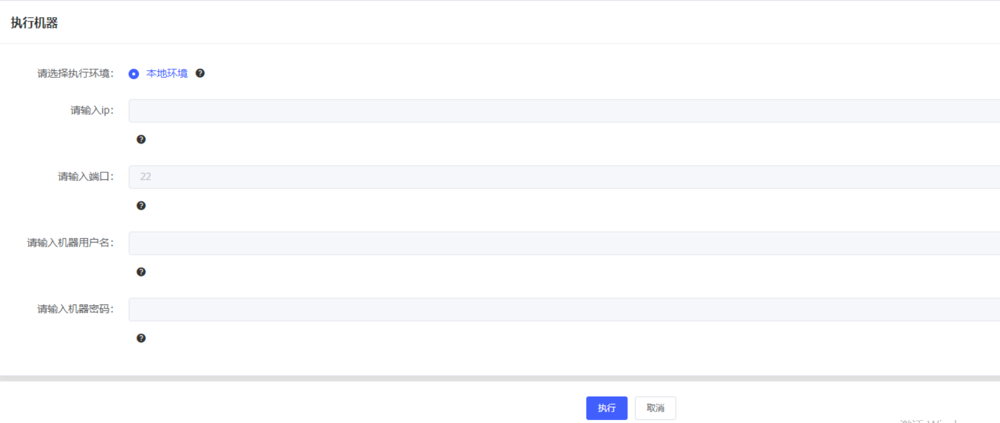
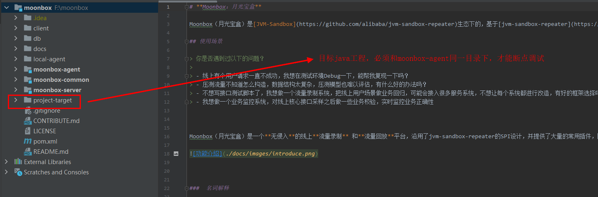

# **介绍**


## Issue
欢迎在Issue中反馈您在月光宝盒使用过程中的 问题 和 建议
https://github.com/vivo/MoonBox/issues

## 如何贡献

如果你还不知道如何开始的话，可以从这个免费的资料里面找到你想要的内容 *<u>#如何在GitHub上位开源项目做贡献</u>* （https://app.egghead.io/playlists/how-to-contribute-to-an-open-source-project-on-github）

## 开发者相关

### 必要前提
请先阅读 [README](./README.md) 文档，了解月光宝盒项目 使用的技术和框架

### 本地调试

#### 代码修改(可选)

若对moonbox-server模块内容修改，因该模块是标准web工程，直接启动即可

若对moonbox-agent模块修改，修改执行后续的打包步骤，修改才可生效

#### 脚本打包

- 执行maven clean install 操作
- 执行 agent 打包脚本

```shell
# 执行打包命令，命令路径为 /moonbox-agent/moonbox-java-agent/bin
sh ./install-local-agent.sh 
```
打包完成后，会在当前用户根目录生成 sandbox 和 .sandbox-module 文件夹

#### 任务启动
请在本地运行moonbox-server 工程，按照[用户操作手册](./docs/user-guide.md) ，配置录制和回放任务。需要注意的是，本地启动时流量和录制的 运行配置，系统会自动判断走本机。如下图

点击“执行”后，即把agent attach到目标java进程上

#### 注意事项

需要注意的是，为了能够在本机进行完整的debug。目标java项目(即进程)需要和moonbox工程在同一个idea目录下。如图所示：

