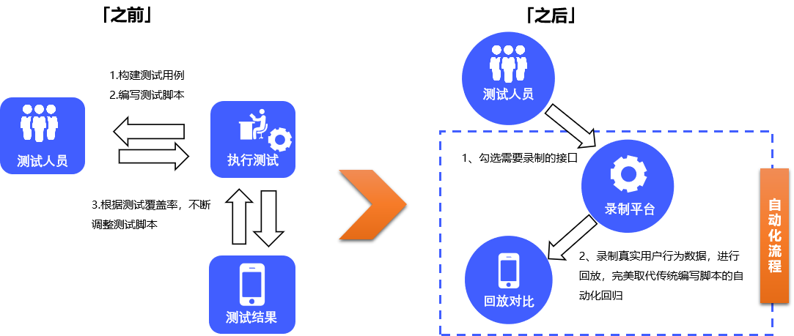

# **Moonbox：月光宝盒**

Moonbox（月光宝盒）是[JVM-Sandbox](https://github.com/alibaba/jvm-sandbox-repeater)生态下的，基于[jvm-sandbox-repeater](https://github.com/alibaba/jvm-sandbox-repeater)重新开发的一款流量回放平台产品。在jvm-sandbox-repeater基础上提供了更加丰富功能，同时便于线上部署和使用，[更多对比参考](./docs/repeater-diff.md)。

## 使用场景

> 你是否遇到过以下的问题？
>
> - 线上有个用户请求一直不成功，我想在测试环境Debug一下，能帮我复现一下吗？
> - 压测流量不知道怎么构造，数据结构太复杂，压测模型也难以评估，有什么好的办法吗？
> - 不想写接口测试脚本了，我想做一个流量录制系统，把线上用户场景做业务回归，可能会接入很多服务系统，不想让每个系统都进行改造，有好的框架选择吗？
> - 我想做一个业务监控系统，对线上核心接口采样之后做一些业务校验，实时监控业务正确性

Moonbox（月光宝盒）是一个**无侵入**的线上**流量录制** 和**流量回放**平台，沿用了jvm-sandbox-repeater的SPI设计，并提供了大量的常用插件，同时也提供数据统计和存储能力。通过Moonbox可以实现自动化测试、线上问题追踪、和业务监控等能力

###  名词解释

- **录制**：把一次请求的入参、出参、**下游RPC、DB、缓存**等序列化并存储的过程
- **回放**：把录制数据还原，重新发起一次或N次请求，对特定的下游节点进行MOCK的过程
- **入口调用**：入口调用一般是应用的**流量来源**，比如http/dubbo，在调用过程中录制调用入参，返回值。回放时作为流量发起和执行结果对比依据
- **子调用**：区别于入口调用，子调用是调用执行过程中某次方法调用。子调用在录制时会记录该方法的入参、返回值；回放时用该返回值进行MOCK
- **MOCK**：在回放时，被拦截的子调用**不会发生真实调用**，利用字节码动态干预能力，将录制时的返回值直接返回
- **降噪**：在回放时，部分回放子调用入参或者回放流量响应结果和原始流量对比不一致字段，对这些非必要字段进行排除对比过程

### 功能介绍

- 流量录制：流量录制模板管理，录制任务下发和录制流量查看
- 流量回放：流量回放任务管理，回放数据查看成功率统计
- 回放mock：流量录制和回放特殊mock（作为子调用mock）
- 对比配置：流量回放字段忽略配置

更多详细功能介绍，详见 [Moonbox操作手册](./docs/user-guide.md)

## 技术原理
技术原理介绍，详见 [技术原理](./docs/project-design.md)

## 快速开始
详见 [快速开始](./docs/quick-start.md)

## Docker部署
详见 [月光宝盒Docker部署](./docs/月光宝盒Docker部署手册.md)

## 未来计划

月光宝盒项目已经在vivo运行2年，接入了上百个项目。内部有较多新特性正在开发和使用中，预计会陆续会对外开源，包括

- 丰富更多的插件
- mysql的数据存储
- 基于c++的流量录制回放
- docker化平台部署
- 用例、场景管理能力
- 定时录制、回放能力

## （微信群）社区交流

  回复：moonbox微信群交流
欢迎优先提交Issue、PR，欢迎使用、共建。

## 谁在使用
如果您在使用MoonBox，请让我们知道，您的使用对我们非常重要：[登记链接](https://github.com/vivo/MoonBox/issues/9) （按登记顺序排列）

