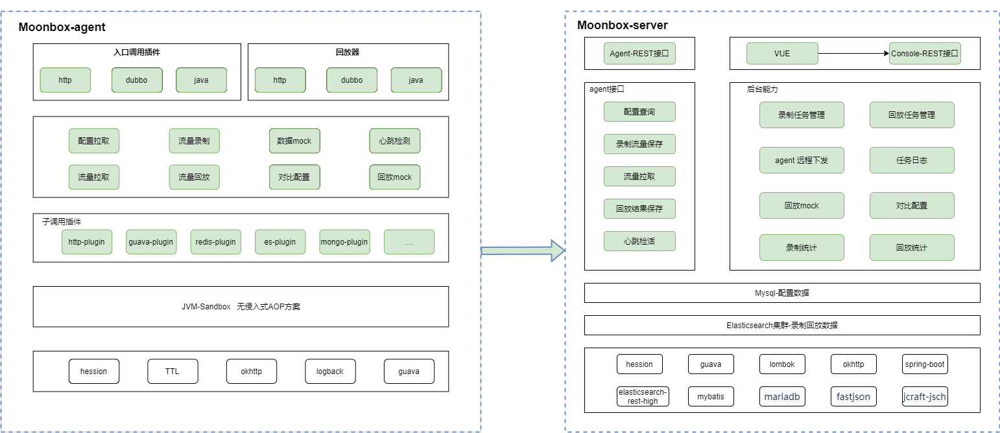
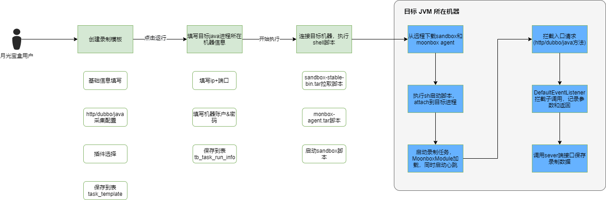
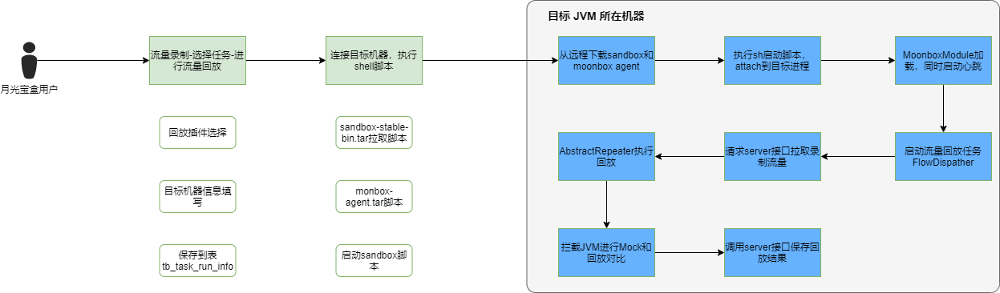
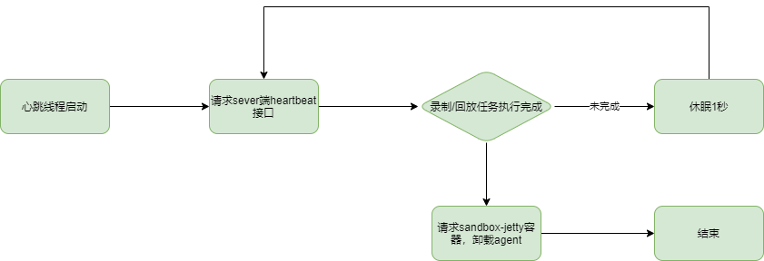
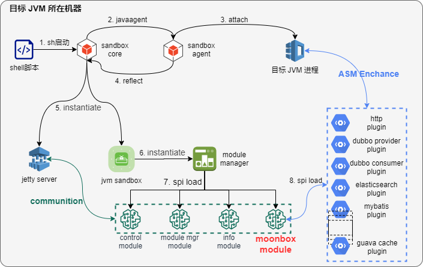
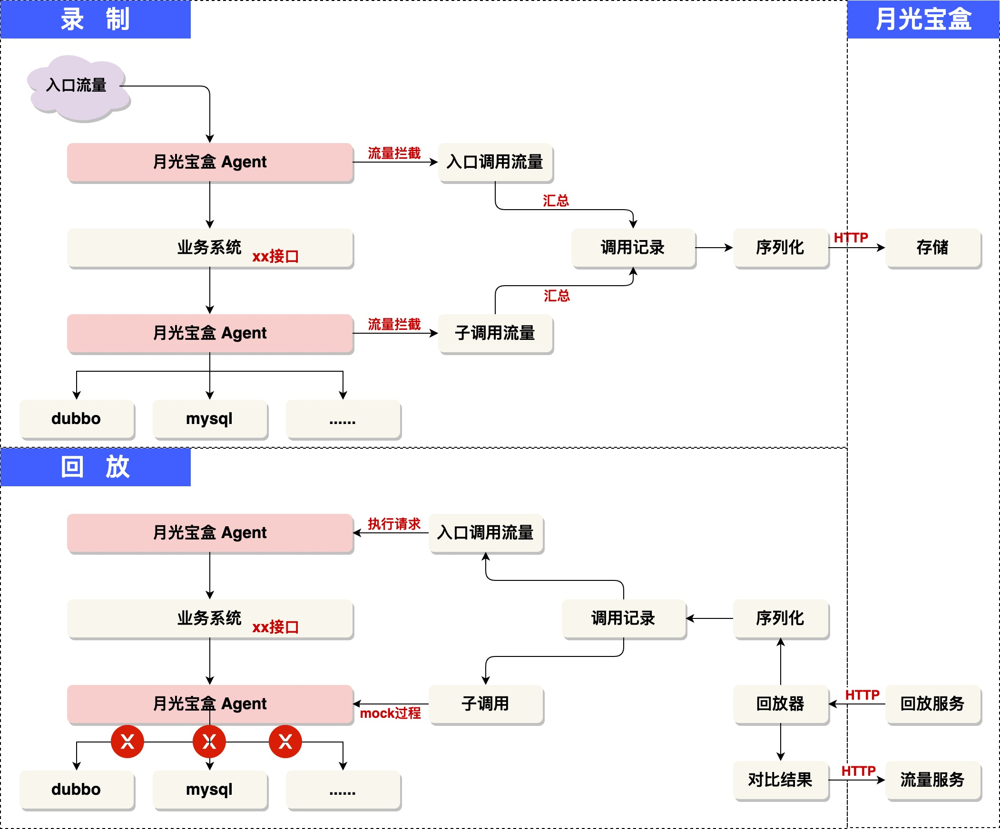

# **技术原理**

### 系统架构图
月光宝盒平台分为2个部分，分别为moonbox-agent 和 moonbox-server

**moonbox-agent**

- 使用java-attach技术(实际的动态字节码增强由JVM-Sandbox实现)动态代理到目标进程上，提供流量录制和回放的增强

**moonbox-server**

- agent端使用接口，提供配置查询、录制流量保存、流量查询、回放结果保存等服务
- 录制任务/回放任务的配置，agent任务远程管理能力和管理后台操作界面(前后端分离部署)

### 系统流程图

#### 流量录制

流量录制的路径为【管理后台-流量录制】，此图描述了大致的流程。其中左侧为月光宝盒后台执行，右侧部分为目标JVM机器执行部分

#### 流量回放

流量回放的路径有两个：【管理后台-流量录制-录制任务-流量回放】和【流量回放-失败回放/重新回放】。

sandbox-agent和moonbo-agent的下载流程，和上一节 *流量录制*  部分相同

#### 心跳请求

流量录制和回放任务启动时，会同时启动心跳线程，通过对此心跳线程 管理目标JVM上装载的 agent。当录制任务和回放任务执行完毕(或状态异常)时，agent上心跳线程调用sandbox-jetty容器接口，进行sandbox和moonbox的agent卸载操作，此过程不影响目标JVM正常功能

#### agent加载

本图描述了Sandbox agent和Moonbox agent 启动的流程，包括 目标java进程attach操作，jetty服务启动和流量回放插件加载示意

### 核心原理

#### 录制回放原理

录制和回放流程沿用 jvm-sandbox-repeater设计，舍弃了一些非主流程功能。

**流量录制** 核心逻辑录制协议基于JVM-Sandbox的`BEFORE`、`RETRUN`、`THROW`事件机制进行录制流程控制，详见[DefaultEventListener](../moonbox-agent/moonbox-java-agent/moonbox-core/src/main/java/com/alibaba/jvm/sandbox/repeater/plugin/core/impl/api/DefaultEventListener.java)

**流量回放** 基于 [FlowDispather](../moonbox-agent/moonbox-java-agent/moonbox-api/src/main/java/com/alibaba/jvm/sandbox/repeater/plugin/api/FlowDispatcher.java) 
进行回放流量分发，每个类型回放插件实现[Repeater](../moonbox-agent/moonbox-java-agent/moonbox-api/src/main/java/com/alibaba/jvm/sandbox/repeater/plugin/spi/Repeater.java)SPI完成回放请求发起；每次回放请求可决定本地回放是否mock，插件也自由实现mock逻辑，mock流程代码

> mock回放：回放流量子调用（eg:mybatis/dubbo)不发生真实调用，从录制子调用中根据 [MockStrategy](../moonbox-agent/moonbox-java-agent/moonbox-api/src/main/java/com/alibaba/jvm/sandbox/repeater/plugin/spi/MockStrategy.java) 
> 搜索匹配的子调用，利用JVM-Sandbox的流程干预能力，有匹配结果，进行`throwReturnImmediately`返回，没有匹配结果则抛出异常阻断流程，避免重复调用污染数据

#### 示意图

