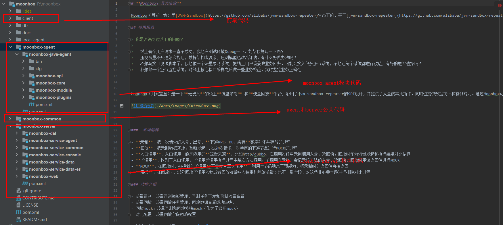

# **快速开始**

### Moonbox平台部署

#### 资源准备

| 资源类型          | 资源版本          | 说明                                                                        |
|---------------|---------------|---------------------------------------------------------------------------|
| jdk           | 1.8           | 工程使用jdk版本                                                                 |
| mysql         | 5.x           | 存储配置数据[建表语句参考](../db/mysql)                                                |
| elasticsearch | 7.x（推荐7.16.2） | 存储录制和回放 json数据 ([es安装文档参考](https://developer.aliyun.com/article/1054281)) |
| 虚拟机/容器        | 无             | 2台分别部署moonbox-server和VUE前端资源(server和vue也可以部署在一台机器)                        |

#### 工程下载
月光宝盒是标准的maven工程，因此机器环境需要安装 java 和 maven 并配置好环境变量。
直接从代码仓下载代码到本地，在根目录执行 mvn clean install操作。执行maven工程的打包构建。

代码结构说明如下：


#### server部署

Moonbox-server是标准的spring-boot工程，只需要按照spring-boot方式启动部署即可。部署前，需要修Moonbox/Moonbox-server/Moonbox-web/src/main/resource/application.properties 中配置

```php
#mysql
spring.datasource.url=mysql链接地址
spring.datasource.username=mysql数据库名称
spring.datasource.password=mysql数据库密码
#es
config.elasticsearch.nodes=es集群http地址
#其他
moonbox.server.url=moonbox-server所部属机器的ip/域名,方便后续和agent交互
```

#### 前端部署

1、修改[vue.config.js](../client/vue.config.js)文件中服务器地址，具体为
```js
module.exports.devServer.proxy."/api".target="moonbox-server所部属机器的ip/域名"
```
2、安装nodejs及配置环境变量，可打开下方链接参考（*nodejs版本建议安装12.10.0，版本过高会导致node-sass安装出现问题*，如果出现权限问题，windows以管理员方式执行cmd执行命令，nodejs 12.10.0安装路径:https://nodejs.org/download/release/v12.10.0/）

[win安装参考](https://zhuanlan.zhihu.com/p/86241466?utm_source=wechat_session)

[mac安装参考](https://blog.csdn.net/m0_67402588/article/details/126075205)

2、打开cmd或powershell，cd至client目录

3、npm install

4、npm run dev

### 系统操作

流量的录制和回放可以在Moonbox管理台上可视化操作，操作详情请见
[Moonbox操作手册](./user-guide.md)

### 关于java进程

moonbox-java-agent 使用 **transmittable-thread-local** (简称ttl)进行跨线程录制回放，因此需要目标java进程使用ttl线程池或ttl runnable接口。

若目标java代码未使用ttl线程池，可以用java agent方式，在目标java进程启动时添加额外增强

```
-javaagent:D:\repository\com\alibaba\transmittable-thread-local\2.10.2\transmittable-thread-local-2.10.2.jar
```

更多请参见[使用`Java Agent`来修饰`JDK`线程池实现类](https://github.com/alibaba/transmittable-thread-local/blob/master/README.md#23-%E4%BD%BF%E7%94%A8java-agent%E6%9D%A5%E4%BF%AE%E9%A5%B0jdk%E7%BA%BF%E7%A8%8B%E6%B1%A0%E5%AE%9E%E7%8E%B0%E7%B1%BB))
