用户使用手册
> Moonbox月光宝盒是一款流量回放平台产品，提供可视化的操作使用界面。关于平台的部署请参考项目 [Readme](http://www.baidu.com) 文件。本文着重介绍平台的主要功能和操作方法.

-----------------------------------------------------
<!-- START doctoc generated TOC please keep comment here to allow auto update -->
<!-- DON'T EDIT THIS SECTION, INSTEAD RE-RUN doctoc TO UPDATE -->
- [流量录制](#%E6%B5%81%E9%87%8F%E5%BD%95%E5%88%B6)
  - [新增/编辑模板](#%E6%96%B0%E5%A2%9E%E7%BC%96%E8%BE%91%E6%A8%A1%E6%9D%BF)
    - [基础信息配置](#%E5%9F%BA%E7%A1%80%E4%BF%A1%E6%81%AF%E9%85%8D%E7%BD%AE)
    - [流量采集配置](#%E6%B5%81%E9%87%8F%E9%87%87%E9%9B%86%E9%85%8D%E7%BD%AE)
      - [http接口](#http%E6%8E%A5%E5%8F%A3)
      - [dubbo接口](#dubbo%E6%8E%A5%E5%8F%A3)
      - [java方法录制](#java%E6%96%B9%E6%B3%95%E5%BD%95%E5%88%B6)
    - [高级选项](#%E9%AB%98%E7%BA%A7%E9%80%89%E9%A1%B9)
  - [运行录制任务](#%E8%BF%90%E8%A1%8C%E5%BD%95%E5%88%B6%E4%BB%BB%E5%8A%A1)
  - [录制与查看](#%E5%BD%95%E5%88%B6%E4%B8%8E%E6%9F%A5%E7%9C%8B)
- [流量回放](#%E6%B5%81%E9%87%8F%E5%9B%9E%E6%94%BE)
  - [录制处回放](#%E5%BD%95%E5%88%B6%E5%A4%84%E5%9B%9E%E6%94%BE)
    - [基础信息配置](#%E5%9F%BA%E7%A1%80%E4%BF%A1%E6%81%AF%E9%85%8D%E7%BD%AE-1)
    - [高级选项](#%E9%AB%98%E7%BA%A7%E9%80%89%E9%A1%B9-1)
  - [回放结果](#%E5%9B%9E%E6%94%BE%E7%BB%93%E6%9E%9C)
    - [回放成功](#%E5%9B%9E%E6%94%BE%E6%88%90%E5%8A%9F)
    - [回放失败](#%E5%9B%9E%E6%94%BE%E5%A4%B1%E8%B4%A5)
      - [结果对比失败](#%E7%BB%93%E6%9E%9C%E5%AF%B9%E6%AF%94%E5%A4%B1%E8%B4%A5)
      - [子调用未匹配](#%E5%AD%90%E8%B0%83%E7%94%A8%E6%9C%AA%E5%8C%B9%E9%85%8D)
      - [子调用入参对比失败](#%E5%AD%90%E8%B0%83%E7%94%A8%E5%85%A5%E5%8F%82%E5%AF%B9%E6%AF%94%E5%A4%B1%E8%B4%A5)
- [回放对比配置](#%E5%9B%9E%E6%94%BE%E5%AF%B9%E6%AF%94%E9%85%8D%E7%BD%AE)
  - [回放详情页](#%E5%9B%9E%E6%94%BE%E8%AF%A6%E6%83%85%E9%A1%B5)
  - [独立菜单项](#%E7%8B%AC%E7%AB%8B%E8%8F%9C%E5%8D%95%E9%A1%B9)
  - [效果演示](#%E6%95%88%E6%9E%9C%E6%BC%94%E7%A4%BA)
- [回放类&方法mock](#%E5%9B%9E%E6%94%BE%E7%B1%BB%E6%96%B9%E6%B3%95mock)
  - [时间mock](#%E6%97%B6%E9%97%B4mock)
  - [java类方法mock](#java%E7%B1%BB%E6%96%B9%E6%B3%95mock)
- [agent文件管理](#agent%E6%96%87%E4%BB%B6%E7%AE%A1%E7%90%86)
  - [功能说明](#%E5%8A%9F%E8%83%BD%E8%AF%B4%E6%98%8E)
  - [操作步骤](#%E6%93%8D%E4%BD%9C%E6%AD%A5%E9%AA%A4)
    - [未修改moonbox-agent](#%E6%9C%AA%E4%BF%AE%E6%94%B9moonbox-agent)
      - [step1：moonbox包上传](#step1moonbox%E5%8C%85%E4%B8%8A%E4%BC%A0)
      - [step2：sandbox包上传](#step2sandbox%E5%8C%85%E4%B8%8A%E4%BC%A0)
    - [已修改moonbox-agent](#%E5%B7%B2%E4%BF%AE%E6%94%B9moonbox-agent)
      - [step1：maven打包(可选)](#step1maven%E6%89%93%E5%8C%85%E5%8F%AF%E9%80%89)
      - [step2：打包moonbox-agent](#step2%E6%89%93%E5%8C%85moonbox-agent)
      - [step3：agent包上传](#step3agent%E5%8C%85%E4%B8%8A%E4%BC%A0)

<!-- END doctoc generated TOC please keep comment here to allow auto update -->

-------------------------------------------

## 流量录制

### 新增/编辑模板

操作路径为：【流量录制-新增模板/编辑】。下面按照页面区域讲解配置项

#### 基础信息配置

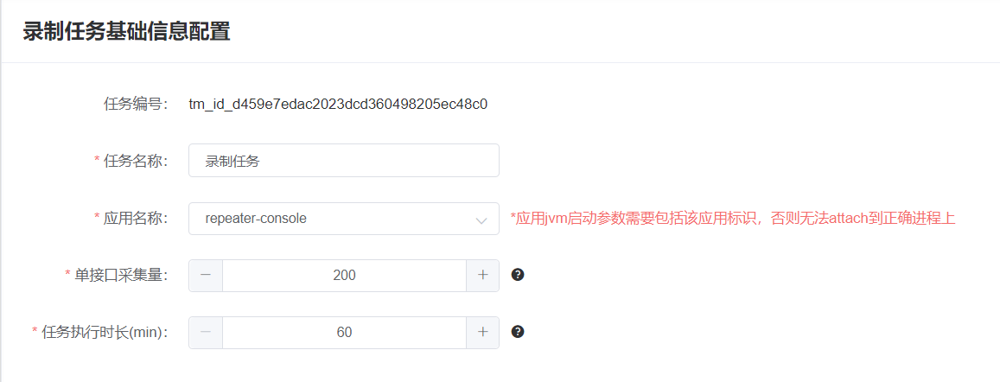

*<font color="#415ff">应用名称</font>：* server端接口 /api/app/appNameList 返回，server部署前需修改为用户自身应用标识。需要注意的是，**<font color="#dd0000">jvm参数需包含该应用标识</font>**，否则”远程录制“方式无法启动

<font color="#415ff">单接口采集量</font>：单个接口的最大采集量

<font color="#415ff">任务运行时长</font>：录制任务运行时长，超过该时长后，录制任务为自动关闭

#### 流量采集配置

录制的流量类型，目前平台支持 http接口，dubbo接口和java方法的录制。

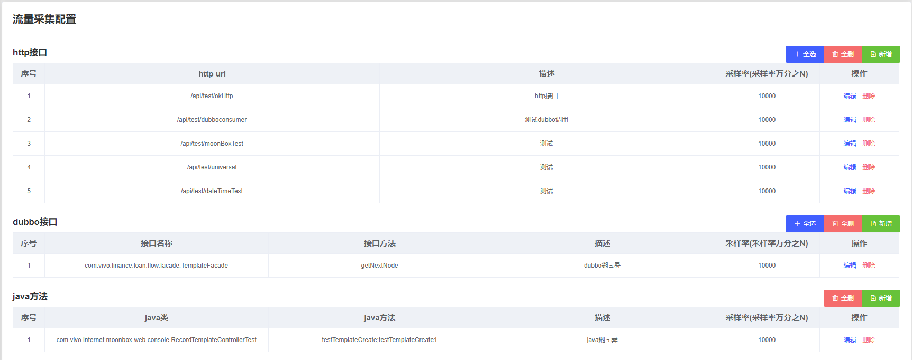

##### http接口

*<font color="#415ff">http uri</font>：* 填写http接口相对地址，支持path variable方配置，如/api/thread/{}

*<font color="#415ff">采样率</font>：* 流量录制采样比率，最大值为 10000，最小值为1

##### dubbo接口

*<font color="#415ff">接口名称</font>：* 支持正则表达式。采集某个具体接口：com.vivo.test.query.TestRecordApi、采集所有接口：.*

*<font color="#415ff">接口方法</font>：* 支持正则表达式。采集某个具体方法名：testRecord、采集所有方法：.*

##### java方法录制

java方法录制比较特殊，由于是依托于spring实现，因此有如下限制：

1. 被录制的方法必须在被Spring容器托管的 bean 中

2. 录制的Java方法必须是 无入参、无返回值 的方法，例如被 @Scheduled 注解修饰定时任务方法

3. 必须提供一个 获取Spring上下文的静态方法 ，如下所示

   ```java
   @Component
   public class ApplicationContextUtils implements ApplicationContextAware {
       private static ApplicationContext applicationContext;
    
       @Override
       public void setApplicationContext(ApplicationContext applicationContext) throws BeansException {
           ApplicationContextUtils.applicationContext = applicationContext;
       }
    
       public static ApplicationContext getApplicationContext() {
           return applicationContext;
       }
   }
   ```

如下图所示，在java方法采集配置时，需要在此处填写上下文方法

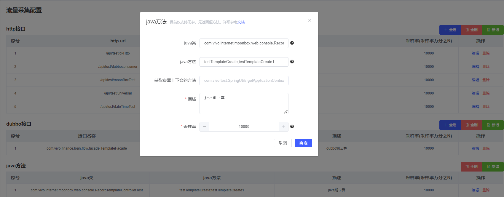

#### 高级选项

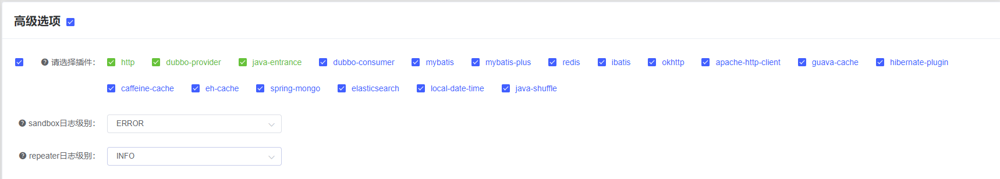

插件类型：展示所有支持的插件(即子调用)类型，点击选择本次使用插件。若录制的接口包含该类型子调用但 未选择该插件，则 录制时不会记录该子调用数据；回访时无法对子调用进行mock

### 运行录制任务

<font color="#415ff">step1：运行录制任务</font>

选择上一步创建的录制模板，点击运行按钮，填写 目标 java进程 所在机器的ip、ssh端口、用户名 和密码。点击执行

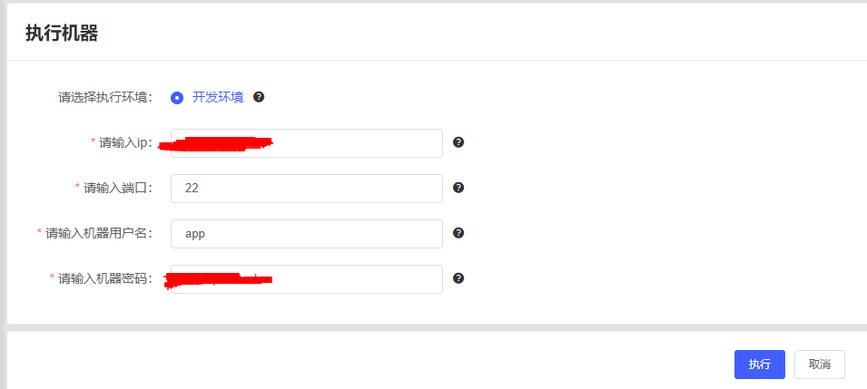

<font color="#415ff">step2：运行成功</font>

执行成功后，在流量录制功能页会 展示启动成功的任务。在此界面进行任务的停止、查看任务日志、查看录制流量详情等功能

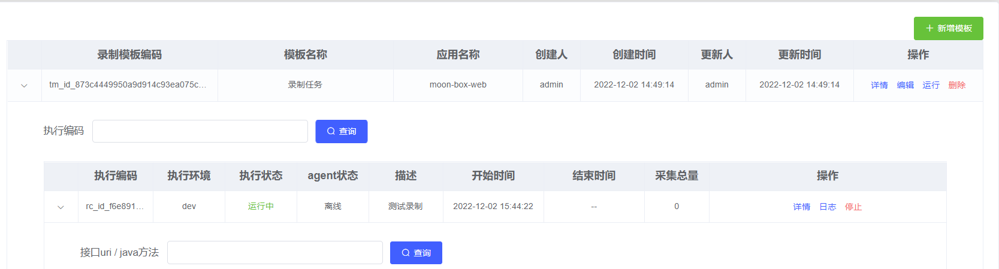

### 录制与查看

<font color="#415ff">step1：运行接口执行录制</font>

若配置的录制接口有访问流量，且被采样成功，则会在下图出显示。采集的流量数据会在列表分页展示

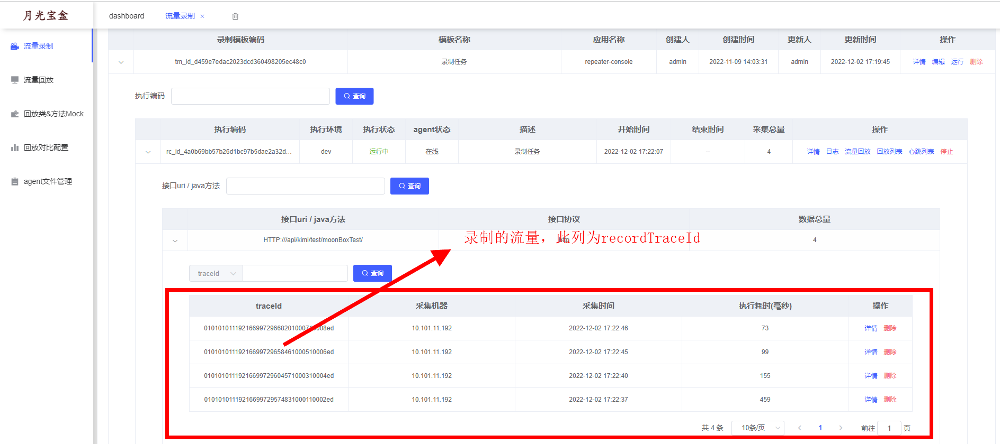

<font color="#415ff">step2：流量详情</font>

点击“详情”按钮可以查看该条录制的流量详情。包括请求的参数、响应参数 和 该请求的 子调用列表

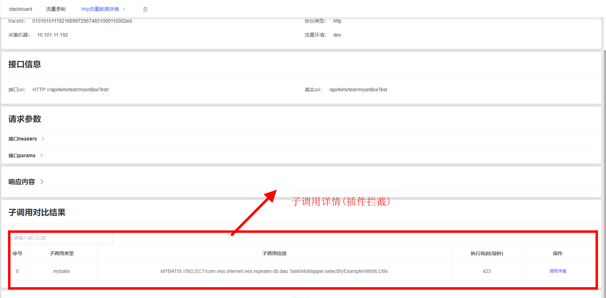

<font color="#415ff">step3：子调用详情</font>

点击某个子调用，可以查看子调用的详情。包括子调用的入参和响应结果。下图以mybatis子调用举例

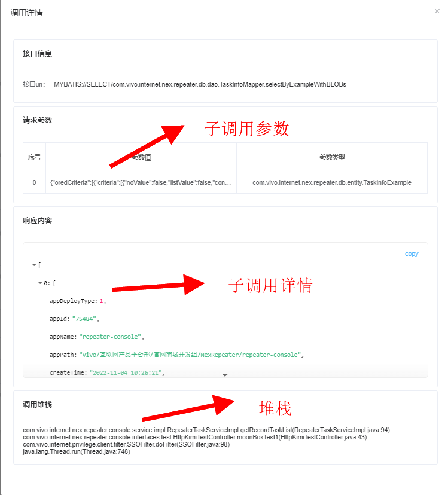

## 流量回放

流量回放操作有两个入口：一个为【流量录制-录制模板-执行任务-流量回放】，另一个为【流量录制-流量回放-回放任务列表-(失败回放/重新回放)】

### 录制处回放

录制处回放入口如下图所示：

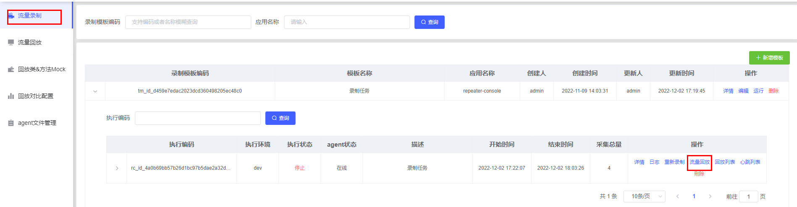

#### 基础信息配置

需要进行回放的数据可以手动选择配置；执行机器处填写 需要回放的 JVM进程 ip、端口、用户名和密码。

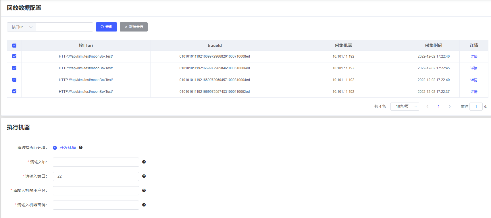

#### 高级选项

此处可以选择sandbox和repeater的日志级别，日志会在目标JVM的业务日志中展示。

选择不同的回放插件，在回放时候可以进行子调用比对和返回结果MOCK。

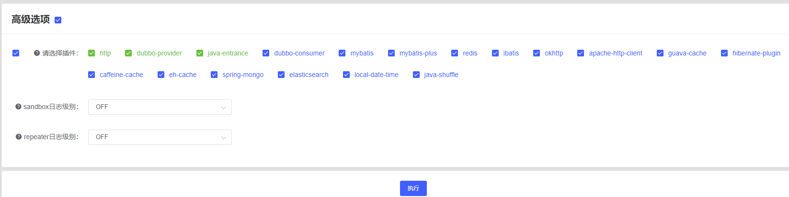

### 回放结果

回放执行的进度会在【流量回放-回放任务列表】中展示。回放的结果按照 <font color="#dd0000">回放接口</font> 分组展示

- 全部成功：该接口下所有流量均回放成功
- 部分成功：该接口下部分流量回放成功
- 全部失败：该接口下所有流量均回放失败

#### 回放成功

点击回放任务会展示此次回放任务的执行结果

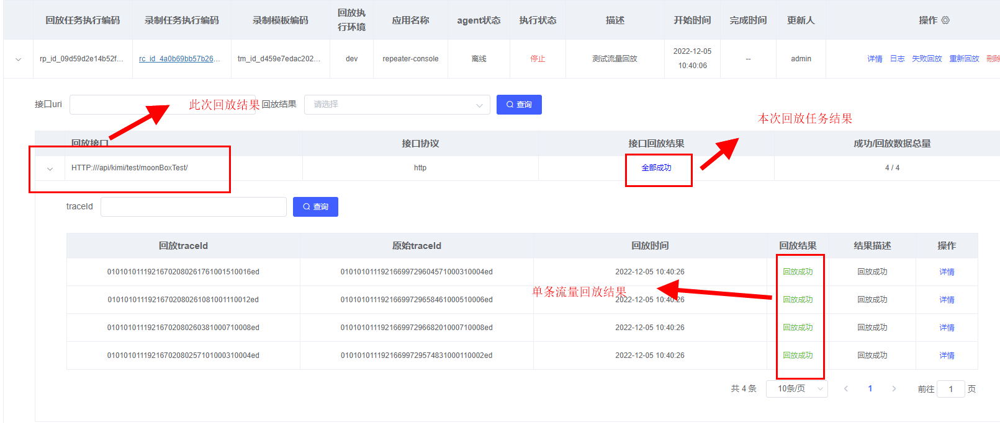

点击单个流量<font color="#dd0000">详情</font>按钮，可以展示此条回放详细信息。包括 响应内容 和 子调用 比对信息

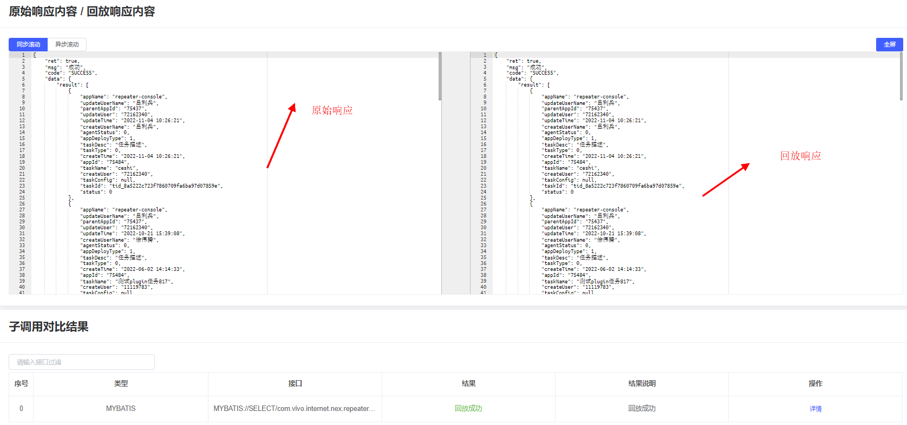

#### 回放失败

单条流量回放失败，主要有以下几种失败原因：结果对比失败、子调用未匹配、子调用入参对比失败

##### 结果对比失败

指的是入口调用返回值对比时，产生了差异。月光宝盒平台会对比原始结果和回放结果，对差异点进行高亮展示

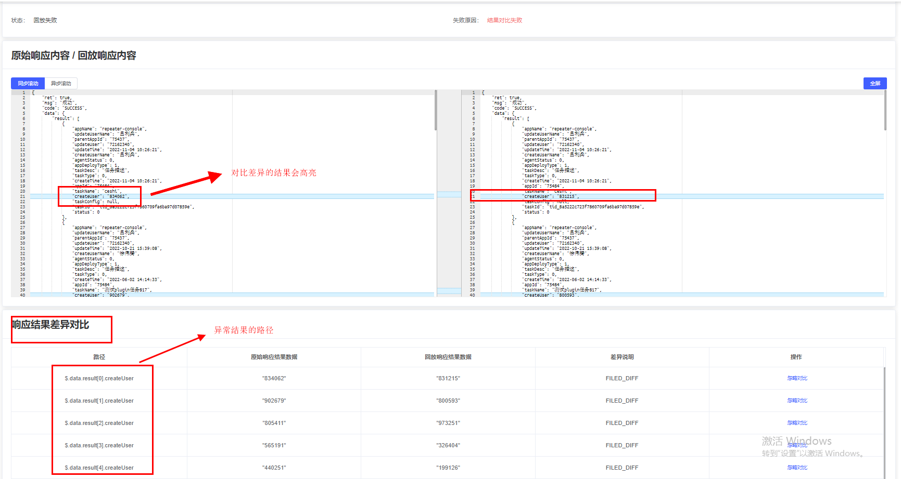

##### 子调用未匹配

指回放时，子调用类型匹配异常，有增多或者减少。常见于代码逻辑产生改动

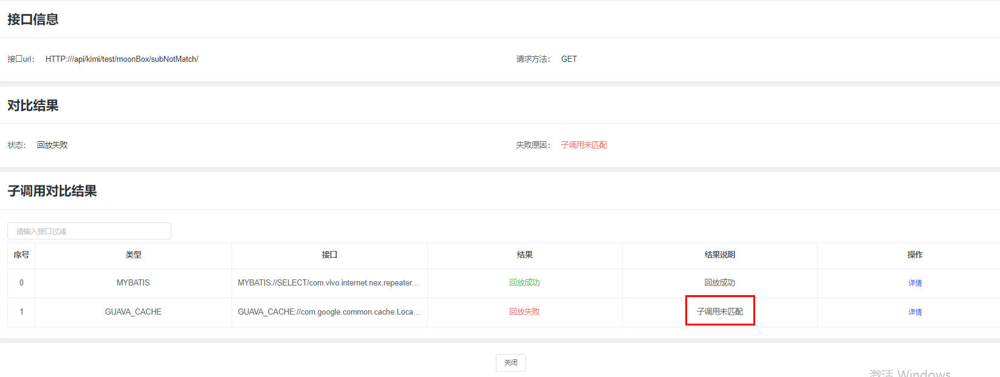

##### 子调用入参对比失败

指子调用参数比对存在问题，回放结果异常。特别说明的是，回访时只对子调用参数进行比对；若参数匹配一致，则对于子调用进行mock，返回录制时记录的结果

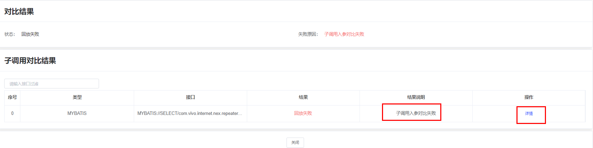

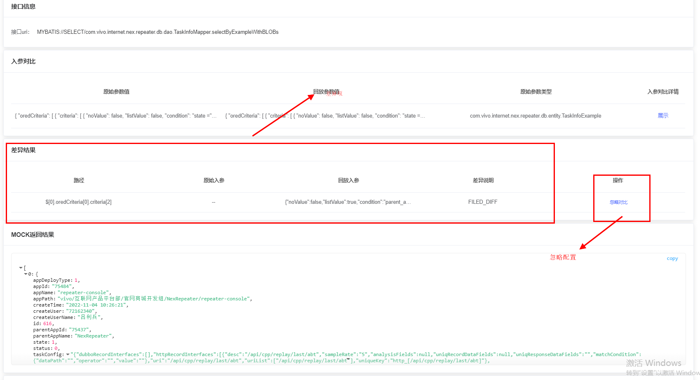

## 回放对比配置

此功能主要是在回放过程中，忽略对比的某个差异项，包括子调用参数差异 和 回放结果对比差异项。配置入口有两处

### 回放详情页

​	可以在回放详情页(路径为【流量回放-回放结果】)  对差异项进行忽略。如下图所示，可以选择需要忽略的参数路径，默认为最小粒度

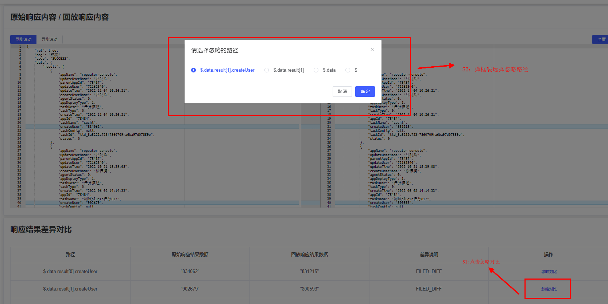

### 独立菜单项

可以在【回放对比配置】菜单项内，进行差异项忽略配置。也可以对已有的配置进行查询搜索。如下图所示：

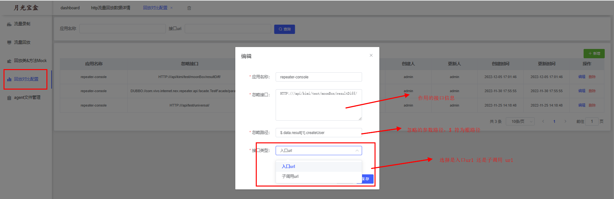

- 忽略路径：指需要忽略的参数路径,$符号为根路径标识，支持按照根路径忽略
- 忽略接口：需要忽略的接口，可以是入口url也可以是子调用url
- 接口类型：入口或子调用类型，需要和忽略接口保持一致

相比于“回放详情页”，此处配置略微复杂，需要手动填写接口和参数信息。建议在“回放详情页”直接操作

### 效果演示

配置完成后，原先回放异常的流量可以 回放成功。如下图所示，即使结果中出现了差异项，回放结果也是成功状态

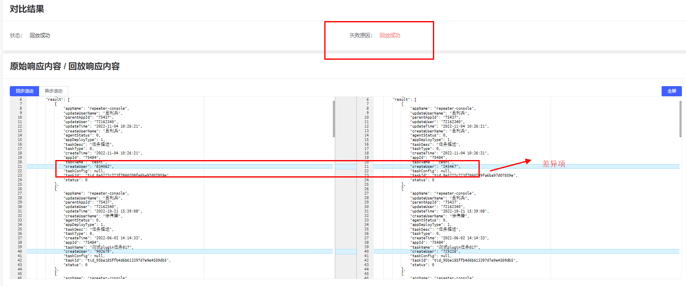

## 回放类&方法mock

回放类&方法mock是一种特殊的mock类型，分为时间mock和普通java方法mock两种

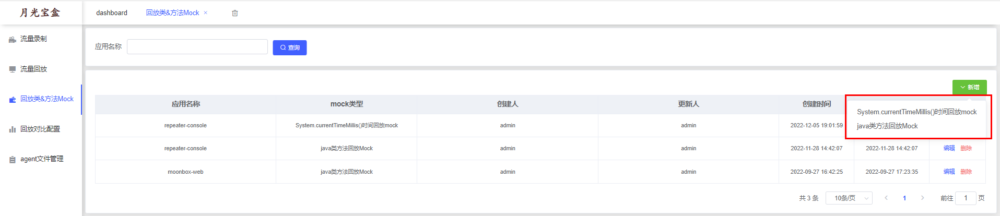

### 时间mock

选择时间mock方式(下拉框第一条)，在类名处填写需要mock的入口类信息。系统会对需要改类以及内部调用的所有时间信息进行mock

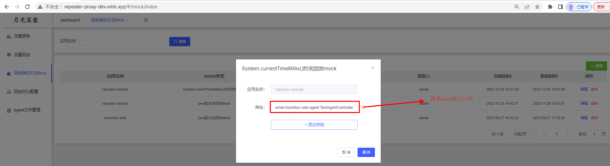

### java类方法mock

此mock方式和子调用mock 非常相似，是对特定的某个java类或方法进行mock返回（由UniversalPlugin 插件处理），可以用在例如 随机数 等场景上，提升回放成功率。该配置全局生效

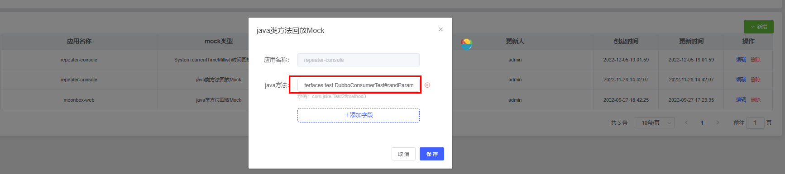

## agent文件管理

### 功能说明
此功能主要为了在moonbox-server服务上传agent文件(包括sandbox-agent 和 moonbox-agent)，以供moonbox-agent端下载使用。
**若是本机部署(wins/mac)测试且未修改moonbox-agent源码，可以忽略此章节！！！**

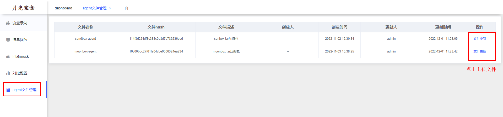

### 操作步骤

#### 未修改moonbox-agent

如果对moonbox-agent代码未做修改，那么直接使用代码工程中打包好的agent文件

##### step1：moonbox包上传

如上图所示点击  moonbox-agent 行 “文件更新”按钮，选择本地的 moonbox-agenr.tar文件。等待文件上传完成

##### step2：sandbox包上传

如上图所示点击  sandbox-agent 行 “文件更新”按钮，选择本地的 sandbox-stable-bin.tar 文件等待文件上传完成

#### 已修改moonbox-agent

如修改过moonbox-agent代码，那么需要把修改过的agent代码重新打包。打包步骤如下

##### step1：maven打包(可选)

执行 mvn clean install操作

##### step2：打包moonbox-agent

```shell
# 执行打包命令，命令路径为 /moonbox-agent/moonbox-java-agent/bin
sh ./install-local-agent.sh 
```

linux/mac环境可以直接运行；windows环境可以在git-bash客户端中运行该命令。命令执行完毕后，会在 /moonbox-agent/moonbox-java-agent/target/.sandbox-module 下 生成新的moonbox-agent.tar文件

##### step3：agent包上传

moonbox-agent “文件更新”上传包，可以选择step2打包生成的 agengt文件即可。

sandbox-agent “文件更新”上传包，可以和使用 /local-agent目录下的 sandbox包
