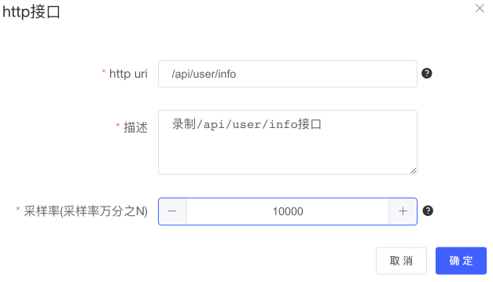
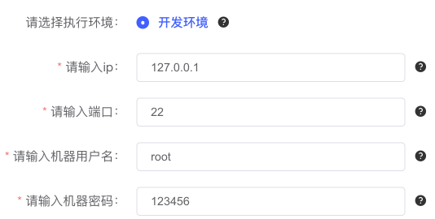

# 月光宝盒Docker部署手册

## 1、极速启动

如果您不想修改任何配置，只想看看月光宝盒有啥功能，下载完代码后，在 **当前工程下的docker文件夹** 下，执行如下命令：

```shell
# x86架构下
docker-compose -f docker-compose.yml up
# arm架构下
docker-compose -f docker-compose-arm64.yml up
```

这需要您保留本机的3307、9201、9301、8081、9999端口号，用于映射月光宝盒MySQL、Elasticsearch、服务端、前端的端口。

看到终端日志中输出了如下日志，说明环境已经准备成功：

```log
moonbox-server           | 2023-02-09 09:25:37.656  INFO 1 --- [           main] o.s.s.concurrent.ThreadPoolTaskExecutor  : Initializing ExecutorService 'applicationTaskExecutor'
moonbox-server           | 2023-02-09 09:25:38.775  INFO 1 --- [           main] o.s.s.c.ThreadPoolTaskScheduler          : Initializing ExecutorService 'taskScheduler'
moonbox-server           | 2023-02-09 09:25:39.478  INFO 1 --- [           main] o.s.b.w.embedded.tomcat.TomcatWebServer  : Tomcat started on port(s): 8080 (http) with context path ''
moonbox-server           | 2023-02-09 09:25:39.502  INFO 1 --- [           main] c.v.i.moonbox.web.MoonBoxApplication     : Started MoonBoxApplication in 42.307 seconds (JVM running for 44.76)
moonbox-server           | 2023-02-09 09:25:40.330  INFO 1 --- [t-task-thread-1] com.zaxxer.hikari.HikariDataSource       : HikariPool-1 - Starting...
moonbox-server           | 2023-02-09 09:25:41.272  INFO 1 --- [t-task-thread-1] com.zaxxer.hikari.HikariDataSource       : HikariPool-1 - Start completed.
```

启动后，在浏览器输入 http://127.0.0.1:9999/ ，即可访问月光宝盒平台。

之后，便可按照 [user-guide](./user-guide.md) 文档所示使用月光宝盒了。

接下来还有几点需要注意的：

* 在选择应用名称时，需要选择moon-box-web，因为moonbox-server容器中运行的JVM进程名为moon-box-web。如果您想录制远程应用，填写远程JVM应用名称即可。
  
  

* 由于我们录制的是月光宝盒服务端应用，因此录制的接口必须是月光宝盒服务端具备的接口，如下例子所示。录制远程JVM应用就填写该应用具备的接口。
  
  

* 由于我们录制的是月光宝盒服务端应用，服务端所在容器的机器信息如下。如果录制远程JVM应用，应填写远程机器的地址（回放配置同理）。
  
  


